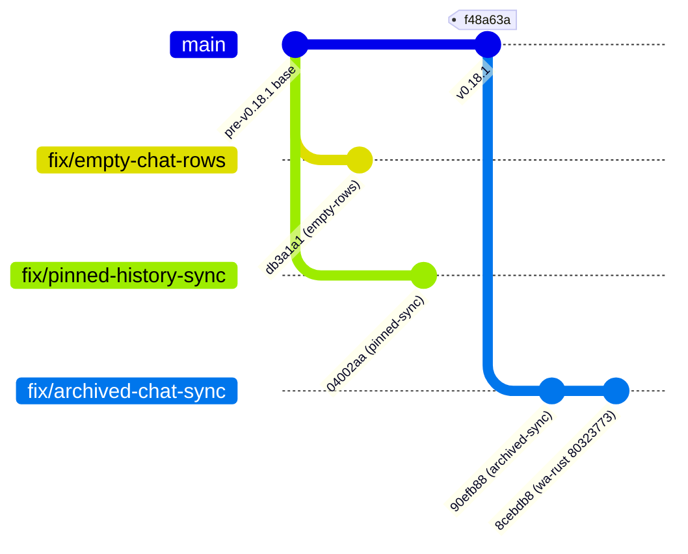

# ZapFast Development & Handoff Context

## Overview

- **Upstream Repository:** `https://github.com/crmne/zapfast.git`
- **Fork Repository:** `https://github.com/YeralAndre/zapfast.git`
- **Current Base:** ZapFast `v0.18.1` (`upstream/main` @ `f48a63a`, tag `v0.18.1` @ `f48a63a`)
- **Active Branch:** `fix/archived-chat-sync` (pushed to `origin/fix/archived-chat-sync`, confirmed rebased on `v0.18.1`)

## Recent Commit History on `fix/archived-chat-sync`

```text
8cebdb8 chore: update whatsapp-rust revision
90efb88 fix(archive): respect auto-unarchive account setting
46cd3d2 docs: add development context
f48a63a (tag: v0.18.1, upstream/main) Release 0.18.1
```

## Custom Protocol Dependency (`whatsapp-rust`)

ZapFast depends on a custom fork of `whatsapp-rust` to support the WhatsApp account-wide unarchive preference:
- **Repository:** `https://github.com/YeralAndre/whatsapp-rust.git`
- **Branch:** `feat/unarchive-chats-setting`
- **Pinned Revision:** `80323773`
- **`Cargo.toml` Entry:**
  ```toml
  whatsapp-rust = { git = "https://github.com/YeralAndre/whatsapp-rust", rev = "80323773", default-features = false, features = ["sqlite-storage", "tokio-transport", "tokio-runtime", "ureq-client", "tokio-native"] }
  ```
- **Rationale:** WhatsApp manages chat unarchive behavior via the account-wide setting `setting_unarchiveChats` (visible in mobile settings as "Keep chats archived" / "Mantener los chats archivados"). When disabled, incoming messages auto-unarchive archived chats. The fork exposes this setting via `Event::UnarchiveChatsSettingUpdate` from the `RegularLow` app-state sync collection.

---

## Isolated Fix Branches

The repository maintains three independent fix branches. Only `fix/archived-chat-sync` is currently rebased on `v0.18.1`; the other two are isolated branches from earlier work whose rebase/audit onto `v0.18.1` is pending:

### 1. `fix/empty-chat-rows` (Rebase on v0.18.1 Pending)
- **Primary Commit:** `db3a1a1 fix: hide empty direct chat rows` (branch `origin/fix/empty-chat-rows`)
- **Objective:** Prevent ghost/phantom chat rows from contacts, group participants, or unmapped privacy IDs that were never established as real conversations.
- **Key Implementation:**
  - `Chat::is_established()` predicate checks:
    - Group or channel chat (`is_group()`, `is_channel()`)
    - Last message present (`last.is_some()`)
    - Activity recorded (`last_activity > 0`)
    - Pinned state (`pinned || pinned_at > 0`)
    - Favorite state (`favorite`)
    - Archived state (`archived`)
    - Locked state (`locked`)
    - Unread state (`looks_unread()`)
  - `Worker::emit_chats` filters for canonical IDs and established chats.
  - `handle_chat_updated` skips inserting unestablished chats into the active list.
  - `Event::Chats` preserves transient user-initiated `StartChat` sessions.

### 2. `fix/pinned-history-sync` (Rebase on v0.18.1 Pending)
- **Primary Commit:** `04002aa fix: fall back to incremental app state sync` (branch `origin/fix/pinned-history-sync`)
- **Objective:** Correct pinned chat preservation during history sync and app-state recovery.
- **Key Implementation:**
  - Prevents `HistorySync` from treating `pinned = Some(0)` as an explicit unpin.
  - App-state recovery gracefully falls back from snapshot to incremental sync on failure.
  - Verified pin/unpin persistence and ordering in runtime.

### 3. `fix/archived-chat-sync` (Confirmed on v0.18.1)
- **Primary Commit:** `90efb88 fix(archive): respect auto-unarchive account setting`
- **Objective:** Automatically unarchive archived chats when a new incoming message arrives, strictly obeying the account-wide "Keep chats archived" preference.
- **Key Implementation:**
  - `Archive` persists setting in the `meta` table with key `setting_unarchive_chats` (`"1"` = true, `"0"` = false, absent = None).
  - `Worker` maintains in-memory `unarchive_chats: Option<bool>`.
  - `Event::UnarchiveChatsSettingUpdate` updates memory and database immediately.
  - `archive_message` triggers `set_archived_at(chat, false, timestamp)` only if:
    - `is_new == true`
    - `!message.from_me`
    - `unarchive_chats == Some(true)`
    - Chat is currently archived.
  - `set_archived_at` enforces timestamp conflict protection against older messages overriding newer explicit archive updates.
  - Fallback: Unknown setting (`None`) or disabled (`Some(false)`) maintains conservative behavior (remains archived).
- **Regression Tests:**
  - `unarchive_chats_setting_round_trips`
  - `incoming_message_unarchives_when_unarchive_setting_enabled`
  - `incoming_message_remains_archived_when_unarchive_setting_disabled`
  - `incoming_message_remains_archived_when_unarchive_setting_unknown`
  - `sent_message_does_not_unarchive_archived_chat`
  - `duplicate_or_existing_incoming_message_does_not_unarchive`
  - `explicit_newer_archive_update_wins_over_older_incoming_message`

---

## Branching & Integration Strategy



> [!IMPORTANT]
> **Branch Status & Consolidation Plan:**
> - `fix/archived-chat-sync` is verified on `v0.18.1`.
> - `fix/empty-chat-rows` and `fix/pinned-history-sync` are isolated branches from earlier development; their audit/rebase onto `v0.18.1` is pending.
> - **Next Planned Step:** Audit and rebase/cherry-pick `empty-chat-rows` and `pinned-history-sync` onto `v0.18.1`, then create a consolidated personal integration branch (e.g., `integration/daily` or `feat/v0.18.1-consolidated`) combining all three fixes.
> - The consolidated branch will be used for daily driving and staging upcoming bug fixes.
> - The `fix/*` branches are retained as clean, isolated sources for future PRs after several days of live validation.

---

## Validation Status (`whatsapp-rust` @ `80323773`)

- `cargo check`: **PASS**
- `cargo fmt --check`: **PASS**
- `cargo clippy --lib -- -D warnings`: **PASS**
- `cargo test --lib`: **987 passed, 0 failed, 8 ignored**

---

## Upcoming Topics (Post-Consolidated Branch)

1. **Community & Channel Filtering:** Better separation of announcement channels and sub-groups in sidebar chips.
2. **Stickers:** Resolving placeholder thumbnails, syncing recents/favorites, and optimizing send latency.
3. **Touchpad Gesture:** Supporting pinch-to-zoom in the image viewer.
4. **General Polish:** Minor UI/UX refinements.

---

## Rules for Future Agents

1. **Trunk / Clean Branch Policy:** Keep `fix/*` branches focused on a single issue without mixing unrelated changes.
2. **Upstream & Dependency Update Policy:**
   - Prefer upstream releases as natural audit points.
   - Update when ZapFast requires specific upstream changes or protocol/transport bug fixes.
   - Small, clear batches of auditable commits may be integrated; large changes or refactors require deeper audit.
3. **Preserve Custom `whatsapp-rust` Rev:** Always verify `Cargo.toml` retains the pinned fork revision (`80323773`) unless updating the fork.
4. **Full Test Suite:** Run `cargo fmt --check`, `cargo clippy --lib -- -D warnings`, and `cargo test --lib` before committing.
5. **No Absolute Paths or Sensitive Data:** Keep logs and documentation clean of machine-specific directories, personal phone numbers, or tokens.
